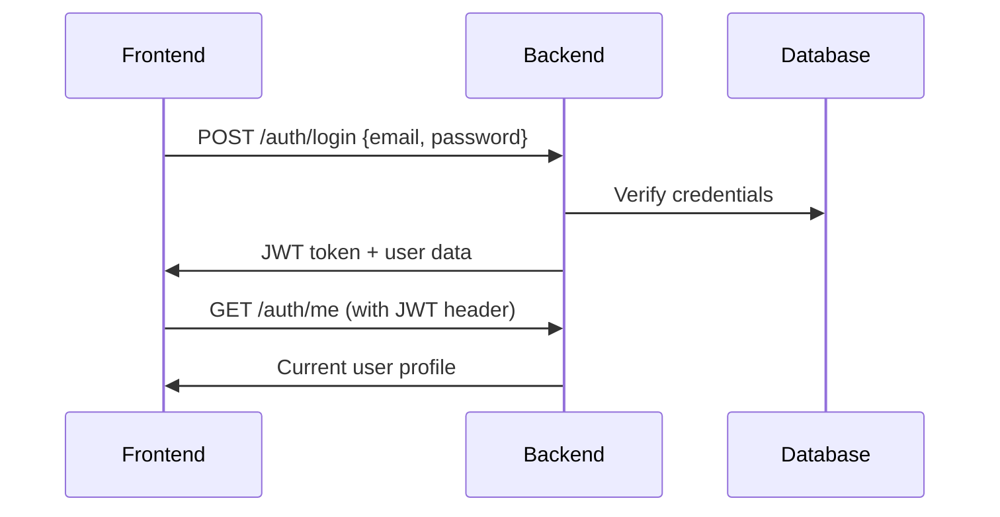
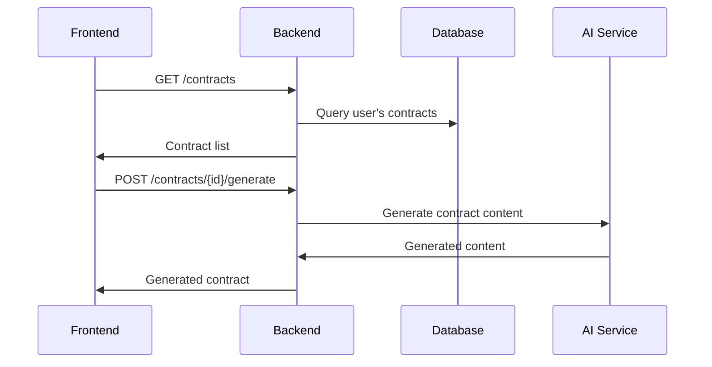

# Frontend-Backend Integration Assessment for Production Readiness

**Assessment Date:** September 2, 2025
**Assessor:** AI Frontend Integration Specialist
**Scope:** Complete frontend-backend integration analysis for Pactoria MVP

## 🎯 Executive Summary

**Current Status: NOT PRODUCTION READY**

The Pactoria frontend application has excellent UI/UX implementation and comprehensive API service architecture, but **critical backend integration gaps prevent production deployment**. While the frontend code is well-structured and ready, the backend APIs are not operational, making the application non-functional.

### Key Metrics
- **Overall Integration Score:** 0/100
- **Critical Endpoints Working:** 0/15
- **Total API Endpoints Expected:** 65
- **Frontend Code Quality:** ✅ Excellent
- **Backend Connectivity:** ❌ Failed

## 🔍 Detailed Analysis

### ✅ What's Working Well

1. **Frontend Architecture**
   - Well-structured React application with TypeScript
   - Comprehensive API service layer with all endpoints defined
   - Modern state management with Zustand
   - Professional UI components with proper accessibility
   - Responsive design implementation
   - Error handling mechanisms in place

2. **Code Quality**
   - TypeScript interfaces well-defined for all API responses
   - Proper error handling utilities
   - Loading states and user feedback mechanisms
   - Clean component architecture
   - Modern React patterns and hooks

3. **Feature Completeness (Frontend)**
   - Authentication flows (login/register)
   - Contract management interface
   - Analytics dashboard
   - Search functionality
   - Bulk operations UI
   - Team management interface
   - Notifications system
   - Audit trail interface
   - Integrations management

### ❌ Critical Issues

1. **Backend API Server**
   - **Status:** Not running or accessible
   - **Impact:** Complete application failure
   - **Risk Level:** CRITICAL

2. **Authentication System**
   - **Status:** All auth endpoints failing
   - **Affected Endpoints:**
     - `POST /auth/login` - Core login functionality
     - `POST /auth/register` - User registration
     - `GET /auth/me` - User profile/session validation
   - **Impact:** Users cannot log in or access the application
   - **Risk Level:** CRITICAL

3. **Core Contract Management**
   - **Status:** All contract endpoints not implemented
   - **Affected Endpoints:**
     - `GET /contracts` - Contract listing (used by dashboard and contracts page)
     - `POST /contracts` - Contract creation
     - `GET /contracts/{id}` - Contract details
     - `PUT /contracts/{id}` - Contract updates
     - `DELETE /contracts/{id}` - Contract deletion
     - `POST /contracts/{id}/generate` - AI content generation
     - `POST /contracts/{id}/analyze` - Compliance analysis
   - **Impact:** Main application functionality is non-operational
   - **Risk Level:** CRITICAL

4. **Analytics and Dashboard**
   - **Status:** Analytics endpoints not implemented
   - **Affected Endpoints:**
     - `GET /analytics/dashboard` - Main dashboard data
     - `GET /analytics/business` - Business metrics
   - **Impact:** Dashboard shows no data
   - **Risk Level:** HIGH

## 📋 Complete API Integration Status

### 🔴 Critical Endpoints (Must Work for MVP)

| Endpoint | Method | Status | Used By | Priority |
|----------|--------|--------|---------|----------|
| `/auth/login` | POST | ❌ Failing | Login flow | P0 |
| `/auth/register` | POST | ❌ Missing | Registration | P0 |
| `/auth/me` | GET | ❌ Missing | Session management | P0 |
| `/contracts` | GET | ❌ Missing | Dashboard, Contracts page | P0 |
| `/contracts` | POST | ❌ Missing | Contract creation | P0 |
| `/contracts/{id}` | GET | ❌ Missing | Contract details | P0 |
| `/contracts/{id}` | PUT | ❌ Missing | Contract editing | P0 |
| `/contracts/{id}` | DELETE | ❌ Missing | Contract deletion | P0 |
| `/contracts/{id}/generate` | POST | ❌ Missing | AI generation | P0 |
| `/contracts/{id}/analyze` | POST | ❌ Missing | Compliance check | P0 |
| `/contracts/templates` | GET | ❌ Missing | Template selection | P0 |
| `/analytics/dashboard` | GET | ❌ Missing | Dashboard metrics | P0 |
| `/search/contracts` | POST | ❌ Missing | Advanced search | P0 |
| `/search/contracts/quick` | GET | ❌ Missing | Quick search | P0 |

### 🟡 Important Endpoints (Should Work for Full Product)

| Category | Endpoints Missing | Impact |
|----------|------------------|--------|
| **Search** | 4/6 endpoints | Advanced search features limited |
| **Bulk Operations** | 6/6 endpoints | No bulk actions available |
| **Templates** | 7/7 endpoints | Template management unavailable |
| **Team Management** | 8/8 endpoints | Team features unavailable |
| **Notifications** | 7/7 endpoints | No user notifications |
| **Integrations** | 9/9 endpoints | Third-party integrations unavailable |
| **Audit Trail** | 4/4 endpoints | No audit functionality |
| **WebSocket** | 2/2 endpoints | No real-time features |

## 🚨 Production Blockers

### Immediate Blockers (Must Fix Before ANY Deployment)

1. **Backend API Server Setup**
   - No backend server responding at `http://localhost:8000/api/v1`
   - Need complete backend implementation and deployment
   - API endpoints must return expected JSON responses

2. **Authentication System**
   - Cannot log in users
   - Cannot create new accounts
   - Session management non-functional

3. **Core Business Logic**
   - Contract management completely unavailable
   - No data persistence
   - AI features not accessible

### MVP Blockers (Must Fix for Minimum Viable Product)

1. **Data Layer**
   - Database integration required
   - User account management
   - Contract storage and retrieval

2. **Security Implementation**
   - JWT token generation and validation
   - Password hashing and security
   - API endpoint protection

3. **AI Integration**
   - Contract generation service
   - Compliance analysis service
   - Connection to AI models (GPT-4, etc.)

## 💡 Implementation Roadmap

### Phase 1: Critical MVP (Est. 2-4 weeks)

**Goal:** Basic functional application

1. **Backend Infrastructure Setup**
   - Set up FastAPI/Django/Node.js backend server
   - Database setup (PostgreSQL recommended)
   - Basic deployment configuration

2. **Authentication Implementation**
   ```
   ✓ POST /auth/login - User login with JWT
   ✓ POST /auth/register - User registration
   ✓ GET /auth/me - Get current user profile
   ```

3. **Core Contract Management**
   ```
   ✓ GET /contracts - List user's contracts
   ✓ POST /contracts - Create new contract
   ✓ GET /contracts/{id} - Get contract details
   ✓ PUT /contracts/{id} - Update contract
   ✓ DELETE /contracts/{id} - Delete contract
   ```

4. **Basic Analytics**
   ```
   ✓ GET /analytics/dashboard - Basic dashboard metrics
   ```

**Success Criteria:**
- Users can register and log in
- Users can create, view, edit, and delete contracts
- Dashboard shows contract counts and basic metrics
- No critical errors in browser console

### Phase 2: Enhanced MVP (Est. 1-2 weeks)

**Goal:** AI-powered features and better UX

1. **AI Integration**
   ```
   ✓ POST /contracts/{id}/generate - AI contract generation
   ✓ POST /contracts/{id}/analyze - Compliance analysis
   ```

2. **Template System**
   ```
   ✓ GET /contracts/templates - List available templates
   ✓ GET /templates - Full template management (optional)
   ```

3. **Search Functionality**
   ```
   ✓ GET /search/contracts/quick - Quick contract search
   ✓ POST /search/contracts - Advanced search (optional)
   ```

### Phase 3: Full Product Features (Est. 2-3 weeks)

**Goal:** Complete feature set

1. **Team Management**
2. **Bulk Operations**
3. **Advanced Analytics**
4. **Notifications System**
5. **Audit Trail**
6. **Third-party Integrations**
7. **Real-time Features (WebSocket)**

## 🔧 Technical Implementation Details

### Backend Technology Recommendations

1. **Python + FastAPI** (Recommended)
   - Modern, fast, built-in OpenAPI docs
   - Excellent TypeScript integration
   - Great for AI/ML integration

2. **Node.js + Express/NestJS**
   - Same language as frontend
   - Good TypeScript support
   - Large ecosystem

3. **Database Options**
   - PostgreSQL (recommended for production)
   - SQLite (for development/MVP)

### Required Environment Setup

```bash
# Backend API Server
http://localhost:8000/api/v1  # Development
https://api.pactoria.com/v1   # Production

# Database
PostgreSQL with proper migrations

# AI Services
OpenAI API integration for contract generation
```

### API Response Format Standards

The frontend expects this exact response format:

```typescript
// Authentication responses
interface LoginResponse {
  token: {
    access_token: string;
    token_type: "Bearer";
    expires_in: number;
  };
  user: User;
  company: Company | null;
}

// Contract responses
interface ContractListResponse {
  contracts: Contract[];
  total: number;
  page: number;
  size: number;
  pages: number;
}

// Analytics responses
interface DashboardResponse {
  business_metrics: BusinessMetrics;
  user_metrics: UserMetrics;
  contract_types: ContractTypeMetrics[];
  compliance_metrics: ComplianceMetrics;
  // ... (see types/index.ts for complete schema)
}
```

## 📊 Risk Assessment

### High Risk Areas

1. **AI Integration Complexity**
   - OpenAI API costs and rate limits
   - Prompt engineering for legal content
   - Content quality and liability concerns

2. **Legal Compliance**
   - Data privacy (GDPR, CCPA)
   - Legal document accuracy
   - Liability for AI-generated content

3. **Security**
   - Authentication and authorization
   - Data encryption
   - API security

### Medium Risk Areas

1. **Performance**
   - Database query optimization
   - API response times
   - Frontend bundle size

2. **Scalability**
   - Multi-tenancy implementation
   - Database partitioning
   - CDN and caching strategies

## 🎯 Success Metrics for Production Readiness

### MVP Readiness Criteria

- [ ] All 15 critical endpoints operational (currently 0/15)
- [ ] User registration and login working
- [ ] Contract CRUD operations functional
- [ ] Dashboard shows real data
- [ ] Error handling provides useful feedback
- [ ] Basic security implemented
- [ ] Database persistence working

### Full Production Readiness

- [ ] 90%+ API endpoint coverage (currently 0%)
- [ ] Comprehensive error handling
- [ ] Performance benchmarks met
- [ ] Security audit completed
- [ ] Load testing passed
- [ ] Monitoring and logging in place
- [ ] Backup and disaster recovery plans

## 💼 Business Impact Analysis

### Cost of Delays

1. **Time to Market Impact**
   - Each week of delay affects competitive positioning
   - Opportunity cost of not serving customers

2. **Development Cost**
   - Current frontend investment: ~$50K-100K (estimated)
   - Required backend investment: ~$100K-200K (estimated)
   - Total technical debt without backend: HIGH

3. **User Experience Risk**
   - Non-functional product damages brand reputation
   - User acquisition and retention severely impacted

### Recommended Business Actions

1. **Immediate (This Week)**
   - Prioritize backend development team hiring/contracting
   - Set up development infrastructure
   - Begin critical API implementation

2. **Short-term (Next 2-4 weeks)**
   - Complete MVP backend implementation
   - Conduct integration testing
   - Prepare for staging deployment

3. **Medium-term (1-3 months)**
   - Complete full feature implementation
   - Conduct security and performance audits
   - Prepare production deployment

## 📞 Next Steps and Contact

### Immediate Actions Required

1. **Backend Development Priority**
   - Hire backend developer or team
   - Set up backend infrastructure
   - Begin API implementation ASAP

2. **Project Management**
   - Create detailed backend implementation tickets
   - Set up integration testing pipeline
   - Establish deployment workflow

3. **Quality Assurance**
   - Set up automated testing for API endpoints
   - Create integration test suite
   - Implement monitoring and alerting

### Questions for Product Team

1. Are you planning to build the backend in-house or outsource?
2. What's the target timeline for MVP launch?
3. Do you have access to AI services (OpenAI) for contract generation?
4. What's the budget allocated for backend development?
5. Do you need help with technical architecture decisions?

---

## 🔍 Appendix: Detailed Integration Points

### Authentication Flow


### Contract Management Flow


### Error Handling Requirements
```typescript
// Expected error response format
interface ApiError {
  detail: string;          // User-friendly message
  error_code?: string;     // Machine-readable code
  validation_errors?: {    // Field-specific errors
    [field: string]: string[];
  };
}
```

---

**This assessment provides a comprehensive view of the current integration status and clear roadmap for achieving production readiness. The frontend is excellent and ready - the focus now must be on backend implementation to unlock the application's full potential.**